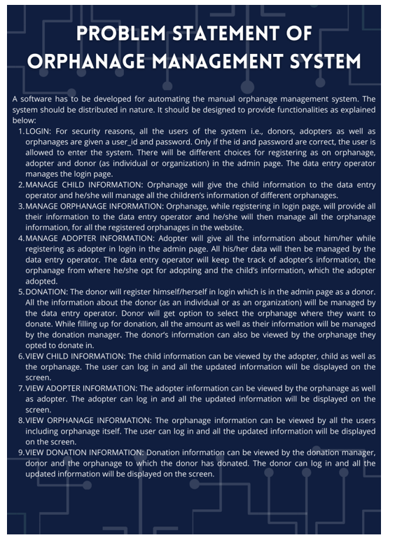

# Orphnage Management System
# WEB APPLICATION
## HTML CSS JS PHP SQL PROJECT
Orphanage Management System is designed and developed for management of information orphanages. It is accessed by users who are based within these orphanages. This enables the users to create, update, search and delete orphan and related records. Apart from this, the user can also assign a specific guardian to the children. He/she can also create, search and update adoption records. For proper function, the users need a reliable internet connection since it is web based. 

This provides information management solutions in an orphanage. It’s secure, user friendliness and intuitiveness make it a proper solution to the manual systems used in managing records within these orphanages. It’s user interface makes it easier to access all the information without necessarily moving from one page to another, therefore user doesn’t have more hassle in accessing the content, creating, updating and retrieving records.

Motive of our system is to eliminate the drawback of previous application and make the whole process simple and to help orphans to the full extend. For this we are going to develop a website. Initial step of the application will be login and register. They will be having three options; they are donation, adoption and orphanage details. In the donation category they can donate food, clothes and money the particular orphanage they wish. In adoption category they will get list of orphans and their details of different orphanages. In this we can view top orphanages, can donate to the orphanage can select and adopt child and children can file complain against any orphanage.

 

#DEMO IMAGES

